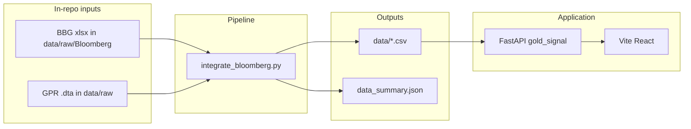

# Architecture — Gold Dashboard V2

**Last Updated:** 2026-03-22

## System overview

Bloomberg Terminal (and public GPR) data are merged in-repo into **`data/*.csv`** via **`scripts/integrate_bloomberg.py`**. A **FastAPI** service under **`backend/gold_signal/`** loads those CSVs, optionally merges **FRED** `DGS2` when 2Y is missing, runs **Stage-1 category signals** and a **majority-vote combiner**, and exposes **walk-forward** summary JSON. A **React (Vite)** app in **`frontend/`** consumes the API. All local file inputs must stay **inside this repository** (enforced in `scripts/integrate_bloomberg.py`).

## High-level diagram



## Domain map

| Domain | Code / location | Spec |
|--------|-----------------|------|
| Data merge (Bloomberg + GPR) | `scripts/integrate_bloomberg.py` | `specs/data-pipeline.md`, `specs/data-contract.md` |
| Bloomberg Excel BDH layout | `references/`, `specs/bloomberg-bdh-paste-plan.md` | Paste plan + `references/bloomberg-data-guide.md` |
| Signals + backtest + API | `backend/gold_signal/` | `specs/execution-timing.md`, `specs/deploy-hosted.md` |
| Dashboard UI | `frontend/` | Vite proxy to API in dev |

## Directory structure (concise)

```
Gold Dashboard V2/
├── AGENTS.md
├── TODO.md
├── requirements.txt
├── Dockerfile                      # API image (optional Phase 2)
├── backend/
│   └── gold_signal/                # FastAPI, ETL panel, signals, walk-forward
├── frontend/                       # Vite + React dashboard
├── scripts/
│   └── integrate_bloomberg.py    # merge pipeline
├── tests/                          # pytest
├── data/                           # generated CSVs + summary (git policy TBD)
├── data/raw/                       # Bloomberg exports, GPR — never point outside repo
├── specs/
├── docs/
│   ├── architecture.md
│   ├── core-beliefs.md
│   ├── quality.md
│   ├── plans/active/
│   └── plans/completed/
├── references/                     # Bloomberg tables, guides
└── .agents/workflows/
```

## Tech stack

| Layer | Choice |
|-------|--------|
| Language | Python 3.11+ (API), TypeScript (frontend) |
| Data | pandas, numpy, openpyxl; optional yfinance for explicit fallback |
| API | FastAPI, uvicorn |
| UI | React 18, Vite 6 |
| Tests | pytest (see `specs/testing-strategy.md`) |

## Conventions

- **Paths:** `GOLD_DATA_DIR`, `GOLD_UPLOAD_DIR`, `GOLD_BDH_EXPORT` must resolve under the project root.
- **Outputs:** Integration writes to `data/`; do not scatter CSVs elsewhere.
- **Bloomberg Excel:** Prefer plain `BDH` spills; see `specs/bloomberg-bdh-paste-plan.md`.

## Error handling and logging

The merge script prints step banners and SKIP messages when optional files are missing; fatal errors use `sys.exit(1)` when gold prices cannot be built.
